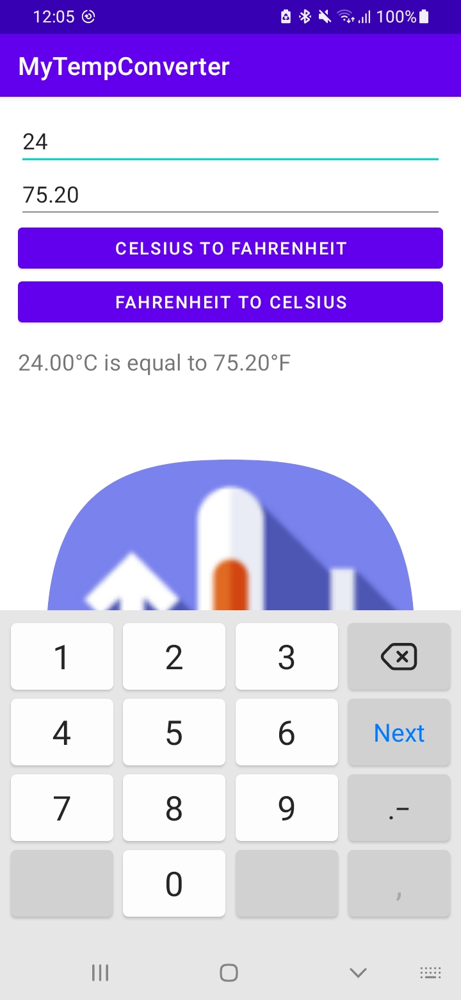
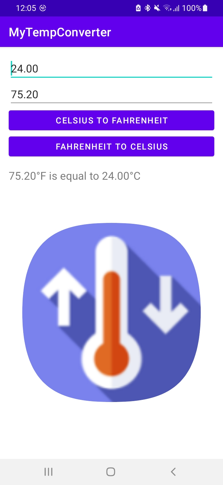

# Temperature Converter App

Task-2 Temperature Converter App 

MyTempConverter is a simple Android app that allows you to convert temperatures between Celsius and Fahrenheit. This app is developed in Java using Android Studio.

Given by: Bharat Intern

## Features

- Convert temperatures from Celsius to Fahrenheit and vice versa.
- User-friendly interface.

## Video Demo

Watch a video demonstration of the MyTempConverter app.

## Screenshots

